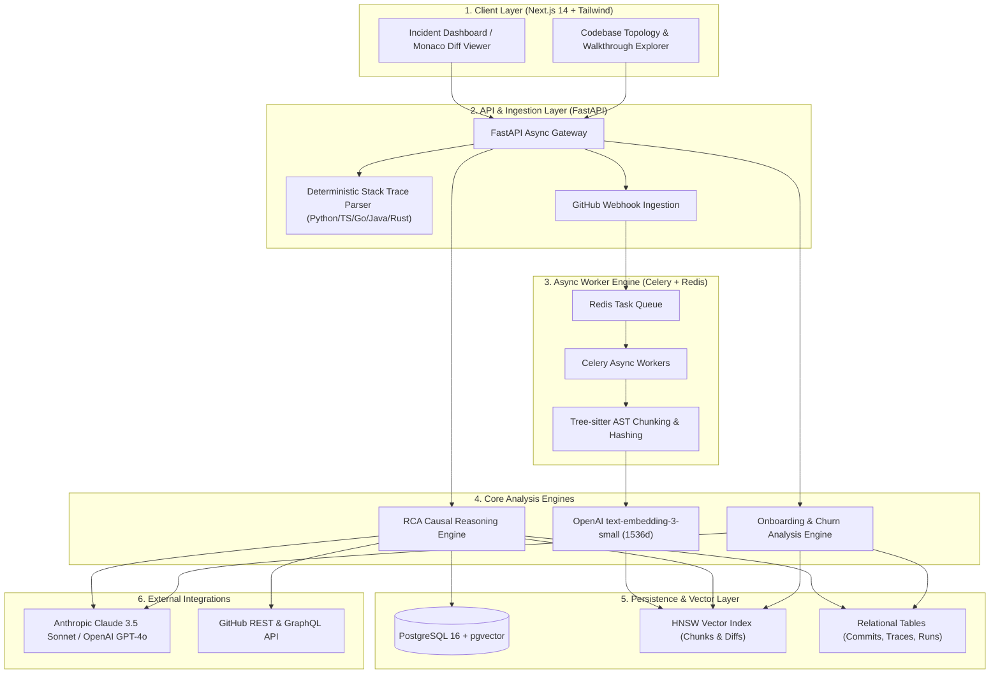
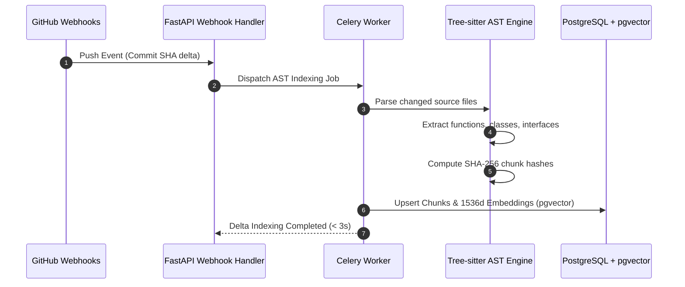
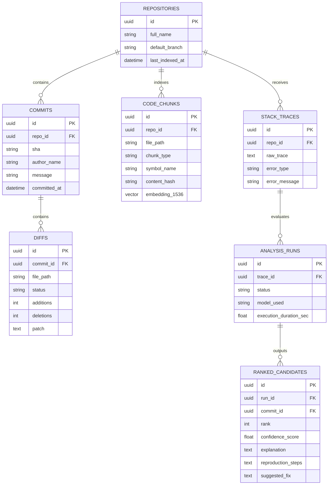

# CLUDE — Architecture Specification

> **Autonomous Production Incident Root-Cause Engine & Codebase Intelligence Platform**
> 
> *A deterministic, semantic causal reasoning engine that pinpoints breaking commits from runtime stack traces in $< 8\text{s}$ and synthesizes codebase onboarding walkthroughs via AST-grounded vector topology.*

---

## 1. Executive System Overview

Modern incident triage relies heavily on manual heuristics (`git log`, `git bisect`, and `git blame`), which only indicate who last touched a line—not whether that modification introduced the breaking state mutation. 

**CLUDE** replaces manual bisection with **Semantic Causal Reasoning**. When a production incident occurs, CLUDE ingests raw multi-language stack traces, extracts deterministic frame coordinates, correlates them across temporal git commit graphs, retrieves relevant AST diff hunks using vector similarity ($1536$-dim HNSW indexing in PostgreSQL `pgvector`), and feeds a constrained context window into an LLM reasoning engine (Claude 3.5 Sonnet / GPT-4o) to output ranked candidate commits with step-by-step reproduction hypotheses and code remediation diffs.

---

## 2. System Architecture & Component Breakdown

### 2.1 Multi-Language Stack Trace Parser
Located at `backend/app/services/stack_trace_parser.py`:
- Deterministically parses call frames across **Python**, **TypeScript/JavaScript** (V8 & WebKit engines), **Go panics**, **Java**, and **Rust**.
- Normalizes disparate path conventions (e.g., `src/services/payment.ts:142:28` vs `services/payment.py, line 45`) into uniform `ParsedStackFrame` schemas.
- Filters out non-application frames (standard libraries, `node_modules`, `venv/`, third-party packages) to concentrate token budgets exclusively on user repository code.

### 2.2 AST Indexing & Structural Chunking Subsystem
Located at `backend/app/services/ast_parser.py`:
- Utilizes **Tree-sitter** grammar parsers to extract semantic language constructs (functions, methods, classes, and interface declarations).
- Computes cryptographic SHA-256 content hashes for every AST chunk to ensure **incremental re-indexing**—skipping unchanged nodes during push webhook delta processing.
- Generates 1536-dimensional vector embeddings via `text-embedding-3-small` and indexes them into PostgreSQL using HNSW cosine distance indexing (`vector_cosine_ops`).

---

## 3. RCA Causal Reasoning Engine

Located at `backend/app/services/rca_engine.py`:

### 3.1 Two-Stage Candidate Retrieval
1. **Direct Coordinate Matching**: Correlates file coordinates and function symbols from top stack frames against repository commits within a configurable temporal window ($\Delta t \le 14\text{ days}$).
2. **Semantic Vector Fallback**: For dynamic invocations or indirect failures where file names differ, executes cosine similarity retrieval against diff hunk embeddings in `pgvector`.

### 3.2 Causal Evaluation & Scoring Formula
Candidate diffs and stack traces are synthesized into an LLM prompt demanding structured JSON output. The calibrated confidence score $C \in [0.00, 1.00]$ is computed based on:

$$C = w_1 \cdot S_{\text{frame\_match}} + w_2 \cdot S_{\text{diff\_overlap}} + w_3 \cdot S_{\text{causal\_plausibility}}$$

- **High Likelihood ($C \ge 0.80$):** Direct structural change in failing code path with explicit failure mechanics.
- **Plausible ($0.50 \le C < 0.80$):** Upstream interface change, signature drift, or configuration modification that indirectly triggers downstream failure.
- **Low Likelihood ($C < 0.50$):** Unrelated refactor in adjacent module.

---

## 4. Onboarding & Codebase Topology Engine

Located at `backend/app/services/onboarding_engine.py`:
1. **System Topology Synthesis**: Analyzes module dependencies and entry points to generate dark-mode **Mermaid.js** architectural diagrams.
2. **Danger Zone & Churn Detection**: Computes commit frequency and entropy metrics to identify files in the $\ge 90\text{th}$ percentile of churn with elevated risk profiles.
3. **Execution Call Paths**: Synthesizes end-to-end execution flows across key platform lifecycle events (request handling, async worker dispatch, and state hydration).

---

## 5. Data Models & Database Schema

---

## 6. Frontend Architecture (Next.js 14 + Monaco)

- **Next.js 14 App Router**: Server and client component separation with dynamic streaming.
- **Monaco Diff Viewer**: Embedded side-by-side syntax-highlighted diff viewer highlighting exact hunk modifications with line anchors.
- **Tailwind CSS & Framer Motion**: Clean dark-mode engineering aesthetic with sub-100ms micro-interactions.
- **Mermaid.js Integration**: Client-side reactive rendering of architectural graphs and call-trace sequence diagrams.

---

## 7. Infrastructure, Concurrency & Security

- **Containerization**: Multi-container Docker Compose setup (`backend`, `celery_worker`, `redis`, `postgres_pgvector`, `frontend`).
- **Async Concurrency**: Non-blocking Celery worker pool running on Redis broker with async SQLAlchemy (`asyncpg`) database driver.
- **Rate Limiting & Token Budgeting**: File exclusion filters (ignoring binaries, lockfiles, SVG, `.min.js`) ensure strict LLM context token optimization ($< 8000$ tokens per evaluation).
- **Security & Permissions**: Read-only GitHub OAuth token scopes with encrypted environment credential handling.
